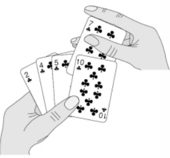

# 插入排序(Insertion Sort)

* 基本思想：在要排序的一组数中，假定前n-1个数已经排好序，现在将第n个数插到前面的有序数列中，使得这n个数也是排好顺序的。如此反复循环，直到全部排好顺序。
  
  
* 稳定性：插入排序是稳定的排序算法。在插入排序中，对于值相同的元素，我们可以选择将后面出现的元素，插入到前面出现元素的后面，这样就可以保持原有的前后顺序不变，所以插入排序是稳定的排序算法。
* 空间复杂度：插入排序是原地排序算法。插入排序算法的运行并不需要额外的存储空间，所以空间复杂度是 O(1)，也就是说，这是一个原地排序算法。
* 时间复杂度：
  * 最好情况：O(n)。如果要排序的数组已经是有序的，我们并不需要搬移任何数据。只需要遍历一遍数组即可，所以时间复杂度是O(n)。
  * 最坏情况：O(n^2)。如果数组是倒序的，每次插入都相当于在数组的第一个位置插入新的数据，所以需要移动大量的数据，因此时间复杂度是O(n^2)。
  * 平均情况：O(n^2)。在一个数组中插入一个元素的平均时间复杂都是O(n)，插入排序需要n次插入，所以平均时间复杂度是O(n^2)。
* 插入排序和冒泡排序的时间复杂度相同，都是 O(n2)，在实际的软件开发里，为什么我们更倾向于使用插入排序算法而不是冒泡排序算法呢？
  * 从代码实现上来看，冒泡排序的数据交换要比插入排序的数据移动要复杂，冒泡排序需要 3 个赋值操作，而插入排序只需要 1 个。 

## 复杂度分析

| Name                  | 最好            | 平均             | 最坏               | 内存    | 稳定    | 备注  |
| --------------------- | :-------------: | :-----------------: | :-----------------: | :-------: | :-------: | :-------- |
| **Insertion sort**    | n               | n2       | n2       | 1         | Yes       |           |

## 动态效果示意图：

## 参考

- [Wikipedia](https://en.wikipedia.org/wiki/Insertion_sort)
- [数据结构与算法之美](https://time.geekbang.org/column/intro/126)