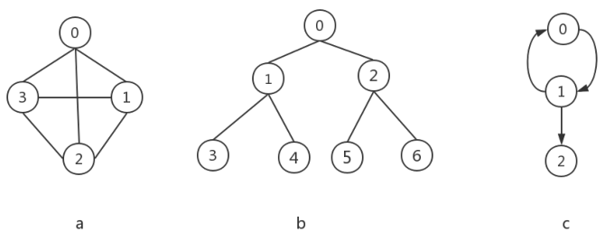
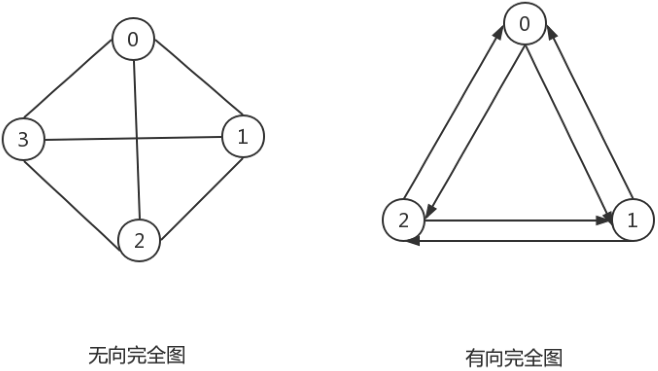
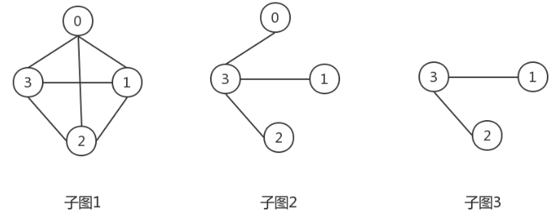
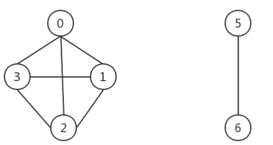
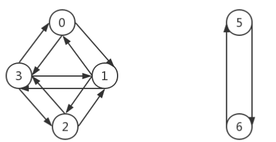

# 图

在计算机科学中, **图(graph)** 是一种抽象数据类型,
旨在实现数学中的无向图和有向图概念，特别是图论领域。

一个图数据结构是一个(由有限个或者可变数量的)顶点/节点/点和边构成的有限集。

如果顶点对之间是无序的,称为无序图,否则称为有序图;

如果顶点对之间的边是没有方向的,称为无向图,否则称为有向图;

如果顶点对之间的边是有权重的,该图可称为加权图。

图是顶点集合（vertex） 和顶点间的关系（edge）组成的一种数据结构:Graph=(V, E)，下图展示了几个
图的示例

## 图的术语

* 有向图：在有向图中，顶点对<x, y>是有序的，<x, y>是从顶点x到顶点y的一条有向边，顶点x是始点，顶点y是终点，<x, y>与 <y, x>是两条不同的边，上图中的c就是一个有向图，它的顶点集合为V(c) = {0,1,2},边集合为E(c) = {<0, 1>, <1,0>,<1,2>}。
* 无向图：在无向图中，顶点对(x,y)是无序的，(x,y)和(y,x)是同一条边，上图中的a就是一个无向图，它的顶点集合为V(a) = {0, 1, 2, 3},它的边集合为E(a)={(0,1), (0,2), (0,3),（1,2）,(1,3), (2,3)}。
* 完全图：一个无向图有n个顶点，有n(n-1)/2条边，那么它就是无向完全图，一个有向图中，有n个顶点，有n(n-1)条边，则是有向完全图，两种图的结构如下：

* 权：边具有与之相关的数值，可以表示从一个顶点到另一个顶点的距离，耗费的时间，这个数值称之为权重。
* 邻接顶点：在无向图中，一条边是(u,v)，那么u和v互为邻接顶点，在有向图中，是一条边，那么顶点u邻接到顶点v，顶点v邻接自顶点u。
* 子图：以上面的无向完全图为例，下面的图展示了它的几个子图

* 度：无向图中有“度”这个概念，表示一个顶点有多少条边。在有向图中，我们把度分为入度（In-degree）和出度（Out-degree）。顶点的入度，表示有多少条边指向这个顶点；顶点的出度，表示有多少条边是以这个顶点为起点指向其他顶点。
* 路径：从顶点vi出发，沿着一些边经过vp1,vp2,...,vpm到达vj，则称（vi，vp1,vp2,...,vpm，vj）是从顶点vi到vj的一条路径。
* 路径长度：对于不带权的图，路径长度是指路径上边的条数，其实对于不带权的图，可以认为边的权值都为1；对于带权的图，路径长度等于路径上各条边的权值之和。
* 连通图和连通分量：在无向图中，如果任意两个顶点之间都是连通的，就称这个图是连通图。非连通图的极大连通子图叫做连通分量，所谓极大连通子图，是指包含顶点个数极大。在非连通图中，从一个顶点开始，采用深度优先或是广度优先无法遍历图的所有顶点，只能访问到该顶点所在的最大连通子图的所有顶点，这些顶点构成一个连通分量。在一个连通图中，只有一个连通分量，而在非连通图中，则有多个连通分量，下图中展示的图是一个非连通图，它有两个连通分量，分别是{0，1，2，3}，{5，6}。

* 强连通图和强连通分量：在有向图中，任意两点(x, y)之间都是连通的，即存在和，那么该图为强连通图，非强连通图，由多个强连通子图构成，非强连通图的极大强连通子图叫做强连通分量，下图是一个非强连通图，它有两个强连通分量。

* 生成树：一个无向连通图的生成树，是它的极小连通子图，这里的极小，是指边的数量最小，如果图有n个顶点，则其生成树有n-1条边构成，在有向图中，则可能得到由它的若干有向树组成的生成森林。

## 图的存储结构

* 邻接矩阵
  * 邻接矩阵的底层依赖一个二维数组。对于无向图来说，如果顶点 i 与顶点 j 之间有边，我们就将 A[i][j] 和 A[j][i] 标记为 1；对于有向图来说，如果顶点 i 到顶点 j 之间，有一条箭头从顶点 i 指向顶点 j 的边，那我们就将 A[i][j] 标记为 1。同理，如果有一条箭头从顶点 j 指向顶点 i 的边，我们就将 A[j][i] 标记为 1。对于带权图，数组中就存储相应的权重。
  * 对于maps[i][j]:
    * 如果i==j, 则maps[i][j]=0
    * 如果i!=j,同时(i,j)存在或者<i,j>存在，则maps[i][j]等于i到j的权重
    * 如果i!=j，同时(i,j)不存在或者<i,j>不存在，则maps[i][j] = 0，表示(i,j)不存在边。
  * 邻接矩阵的问题:
    * 优点：
      * 首先，邻接矩阵的存储方式简单、直接，因为基于数组，所以在获取两个顶点的关系时，就非常高效。
      * 其次，用邻接矩阵存储图的另外一个好处是方便计算。这是因为，用邻接矩阵的方式存储图，可以将很多图的运算转换成矩阵之间的运算。比如求解最短路径问题时会提到一个[Floyd-Warshall](https://zh.wikipedia.org/wiki/Floyd-Warshall) 算法，就是利用矩阵循环相乘若干次得到结果。
    * 缺点：
      * 浪费存储空间。对于无向图来说，如果 A[i][j] 等于 1，那 A[j][i] 也肯定等于 1。实际上，我们只需要存储一个就可以了。也就是说，无向图的二维数组中，如果我们将其用对角线划分为上下两部分，那我们只需要利用上面或者下面这样一半的空间就足够了，另外一半白白浪费掉了。
      * 还有，如果我们存储的是稀疏图（Sparse Matrix），也就是说，顶点很多，但每个顶点的边并不多，那邻接矩阵的存储方法就更加浪费空间了。比如微信有好几亿的用户，对应到图上就是好几亿的顶点。但是每个用户的好友并不会很多，一般也就三五百个而已。如果我们用邻接矩阵来存储，那绝大部分的存储空间都被浪费了。。
      * 遍历邻边较慢 O(V)，V:顶点数
  
* 邻接表
  * 邻接矩阵存储起来比较浪费空间，但是使用起来比较节省时间。相反，邻接表存储起来比较节省空间，但是使用起来就比较耗时间。
  * 邻接表由图中每个顶点以及和顶点相邻的顶点列表组成。
  * 这个列表有很多中方式来存储: 数组/链表/字典(哈希表)都可以。
  * 比如我们要表示和A顶点有关联的顶点(边), A和B/C/D有边, 那么我们可以通过A找到对应的数组/链表/字典, 再取出其中的内容就可以啦
  * 邻接表的问题:
    * 优点：
      * 节省存储空间
      * 遍历邻边较快 O(E)，E:邻边数
    * 缺点：
      * 邻接表存储方法中每个顶点都对应一个链表，存储与其相连接的其他顶点。但链表不方便查找，所以查询效率没有邻接矩阵存储方式高。针对这个问题，邻接表还有改进升级版，即将链表换成更加高效的动态数据结构，比如平衡二叉查找树、跳表、散列表等。
      * 邻接表计算"出度"是比较简单的(出度: 指向别人的数量, 入度: 指向自己的数量)。
      * 邻接表如果需要计算有向图的"入度", 那么是一件非常麻烦的事情。
      * 它必须构造一个"“逆邻接表", 才能有效的计算"入度"。 但是开发中"入度"用的比较少。
  

## 图的搜索

* 图的搜索思想
  * 我们知道，算法是作用于具体数据结构之上的，深度优先搜索算法和广度优先搜索算法都是基于“图”这种数据结构的。这是因为，图这种数据结构的表达能力很强，大部分涉及搜索的场景都可以抽象成“图”。
  * 图上的搜索算法，最直接的理解就是，在图中找出从一个顶点出发，到另一个顶点的路径。具体方法有很多，比如今天要讲的两种最简单、最“暴力”的深度优先、广度优先搜索，还有 A*、IDA* 等启发式搜索算法。
* 有两种算法可以对图进行搜索
  * 广度优先搜索(Breadth-First Search, 简称BFS)，直观地讲，它其实就是一种“地毯式”层层推进的搜索策略，即先查找离起始顶点最近的，然后是次近的，依次往外搜索。
  
  * 深度优先搜索(Depth-First Search, 简称DFS).最直观的例子就是“走迷宫”。假设你站在迷宫的某个岔路口，然后想找到出口。你随意选择一个岔路口来走，走着走着发现走不通的时候，你就回退到上一个岔路口，重新选择一条路继续走，直到最终找到出口。这种走法就是一种深度优先搜索策略。
  
  * 两种搜索算法, 都需要明确指定第一个被访问的顶点.
* 两种算法的思想:
  * BFS: 基于队列, 入队列的顶点先被探索.
  * DFS: 基于栈或者使用递归, 通过将顶点存入栈中, 顶点是沿着路径被探索的, 存在新的相邻顶点就去访问.
* 搜索的注意点:
  * 完全探索一个顶点要求我们便查看该顶点的每一条边.
  * 对于每一条所连接的没有被访问过的顶点, 将其标注为被发现的, 并将其加进待访问顶点列表中.
  * 为了保证算法的效率: 每个顶点至多访问两次.

## 参考

- [Wikipedia](https://en.wikipedia.org/wiki/Graph_(abstract_data_type))
- [Introduction to Graphs on YouTube](https://www.youtube.com/watch?v=gXgEDyodOJU&index=9&list=PLLXdhg_r2hKA7DPDsunoDZ-Z769jWn4R8)
- [Graphs representation on YouTube](https://www.youtube.com/watch?v=k1wraWzqtvQ&index=10&list=PLLXdhg_r2hKA7DPDsunoDZ-Z769jWn4R8)