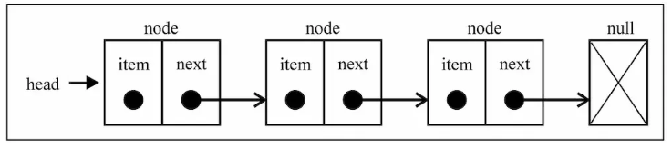

# 链表

* 链表存储有序的元素集合，但不同于数组，链表中的元素在内存中并不是连续放置的。每个元素由一个存储元素本身的节点和一个指向下一个元素的引用（也称指针或链接）组成

相对于数组, 链表有一些优点:

* 内存空间不是比是连续的. 可以充分利用计算机的内存. 实现灵活的内存动态管理.
* 链表不必在创建时就确定大小, 并且大小可以无限的延伸下去.
* 链表在插入和删除数据时, 时间复杂度可以达到O(1). 相对数组效率高很多.

相对于数组, 链表有一些缺点:

* 链表访问任何一个位置的元素时, 都需要从头开始访问.(无法跳过第一个元素访问任何一个元素).
* 无法通过下标直接访问元素, 需要从头一个个访问, 直到找到对应的问题

链表的方法如下：

* append， 添加一个新的元素
* insert，在指定位置插入一个元素
* remove，删除指定位置的节点
* remove_head，删除首节点
* remove_tail，删除尾节点
* indexOf，返回指定元素的索引
* findByIndex，返回指定索引位置的元素
* head，返回首节点
* tail，返回尾节点
* length，返回链表长度
* isEmpty，判断链表是否为空
* clear，清空链表
* print，打印整个链表

链表的相关算法如下：

* `简单` [141. 环形链表](./hasCycle.js)
* `简单` [876. 链表的中间结点](./middleNode.js)
* `简单` [206. 反转链表](./reverseList.js)
* `中等` [19. 删除链表的倒数第N个节点](./removeNthFromEnd.js)
* `中等` [24. 两两交换链表中的节点](./swapPairs.js)
