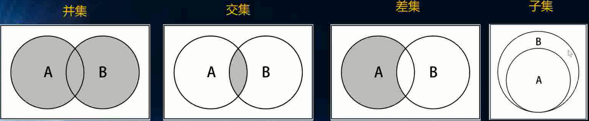

# 集合

* 集合（set）是一种包含不同元素的数据结构。集合中的元素称为成员。集合的两个最重要特性是：首先，集合中的成员是无序的；其次，集合中不允许相同成员存在。集合在计算机科学中扮演了非常重要的角色，然而在很多编程语言中，并不把集合当成一种数据类型。当你想要创建一个数据结构，用来保存一些独一无二的元素时，比如一段文本中用到的单词，集合就变得非常有用

集合方法如下：

* add(value)：向集合添加一个新的项。
* remove(value)：从集合移除一个值。
* contains(value)：如果值在集合中，返回true，否则返回false。
* clear()：移除集合中的所有项。
* size()：返回集合所包含元素的数量。与数组的length属性类似。
* values()：返回一个包含集合中所有值的数组

下面是一些使用集合时必须了解的定义:

* 不包含任何成员的集合称为空集，全集则是包含一切可能成员的集合。
* 如果两个集合的成员完全相同，则称两个集合相等
* 如果一个集合中所有的成员都属于另外一个集合，则前一集合称为后一集合的子集

对集合的基本操作有下面几种:

* 并集 （union）
将两个集合中的成员进行合并，得到一个新集合。
* 交集 （intersect）
两个集合中共同存在的成员组成一个新的集合。
* 补集(差集)（difference）
属于一个集合而不属于另一个集合的成员组成的集合。
* 子集（subSet）
验证一个给定集合是否是另一个集合的子集。

