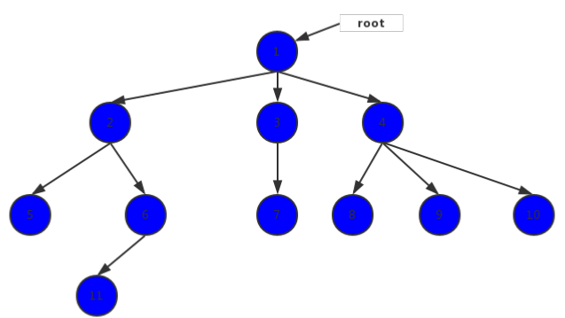
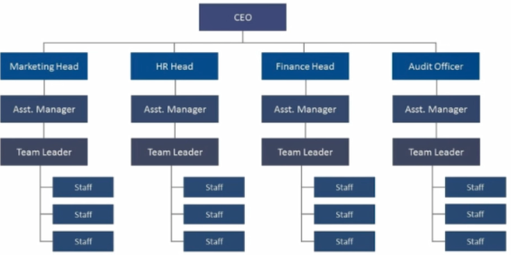
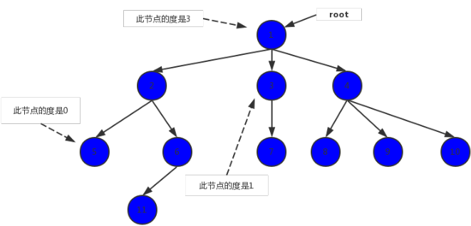
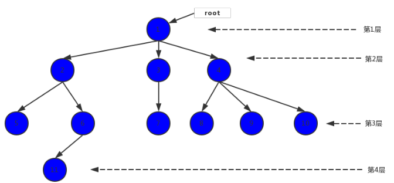

# 树

* 树是计算机科学中经常用到的一种数据结构。树是一种非线性的数据结构，以分层的方式存储数据。树被用来存储具有层级关系的数据，比如文件系统中的文件；树还被用来存储有序列表。

树是一种非线性的数据结构，是由n(n>=0)个节点组成的集合。

* 如果n=0,是一棵空数
* 如果n>0,树有一个特殊的节点，这个节点没有父节点，被称为根节点（root）
* 除根结点之外的其余数据元素被分为m（m≥0）个互不相交的集合T1，T2，……Tm-1，其中每一个集合Ti（1<=i<=m）本身也是一棵树，被称作原树的子树

下图是一棵树的结构图

## 为什么要有树结构

* 树结构本身是一种天然的组织架构
* 高效

## 树的术语

* 节点：它包含数据项，和指向其他节点的指针，上图中的树，有11个节点

* 节点的度：节点所拥有的子树的数量

* 叶节点：度为0的节点被成为叶节点， 如上图中的 5 7 8 9 10 11
* 分支节点：除叶节点外的节点就是分支节点， 如上图中的 1 2 3 4 6
* 父节点：若节点x有子女节点，则x为子女节点的父节点，例如 1是 2 3 4 的父节点，2 是 5 6 的父节点
* 兄弟节点：同一个父节点的子女节点互称为兄弟， 如 5 和 6 是兄弟节点
* 祖先节点：从根节点到该节点所进过分支上的所有节点，如节点5 ，它的祖先节点为 1 2
* 子孙节点：某一个节点的子女，以及这些子女的子女都是该节点的子孙节点，如节点2 ，5 6 11 都是它的子孙节点
* 节点所在层次：根节点在第一层，它的子女在第二层，以此类推

* 树的深度：树中距离根节点最远的节点所处的层次就是树的深度，上图中，树的深度是4
* 树的度：树中节点的度的最大值，上图中，所有节点的度的最大值是3，树的度就是3

## 树的优点

* 我们之前已经学习了多种数据结构来保存数据, 为什么要使用树结构来保存数据呢?
  * 树结构和数组/链表/哈希表的对比有什么优点呢?
* 数组:
  * 优点:
    * 数组的主要优点是根据下标值访问效率会很高.
    * 但是如果我们希望根据元素来查找对应的位置呢?
    * 比较好的方式是先对数组进行排序, 再进行二分查找.
  * 缺点:
    * 需要先对数组进行排序, 生成有序数组, 才能提高查找效率.
    * 另外数组在插入和删除数据时, 需要有大量的位移操作(插入到首位或者中间位置的时候), 效率很低.
* 链表:
  * 优点:
    * 链表的插入和删除操作效率都很高.
  * 缺点:
    * 查找效率很低, 需要从头开始依次访问链表中的每个数据项, 直到找到.
    * 而且即使插入和删除操作效率很高, 但是如果要插入和删除中间位置的数据, 还是需要重头先找到对应的数据.
* 哈希表:
  * 优点:
    * 我们学过哈希表后, 已经发现了哈希表的插入/查询/删除效率都是非常高的
    * 但是哈希表也有很多缺点.
  * 缺点
    * 空间利用率不高, 底层使用的是数组, 并且某些单元是没有被利用的.
    * 哈希表中的元素是无序的, 不能按照固定的顺序来遍历哈希表中的元素.
    * 不能快速的找出哈希表中的最大值或者最小值这些特殊的值.
* 树结构:
  * 我们不能说树结构比其他结构都要好, 因为每种数据结构都有自己特定的应用场景.
  * 但是树确实也综合了上面的数据结构的优点(当然优点不足于盖过其他数据结构, 比如效率一般情况下没有哈希表高), 并且也弥补了上面数据结构的缺点.
  * 而且为了模拟某些场景, 我们使用树结构会更加方便. 比如文件的目录结构.

## 树的分类

* [二叉搜索树](binary-search-tree)

## 参考

- [Wikipedia](https://en.wikipedia.org/wiki/Tree_(data_structure))
- [YouTube](https://www.youtube.com/watch?v=oSWTXtMglKE&list=PLLXdhg_r2hKA7DPDsunoDZ-Z769jWn4R8&index=8)
- [简书](https://www.jianshu.com/p/b7d501591eb7)