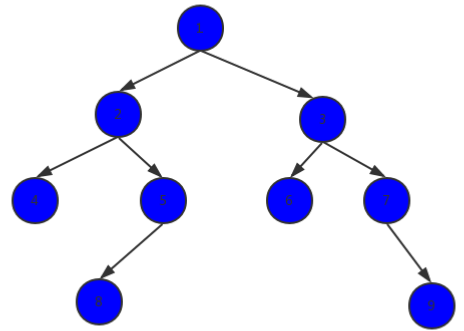
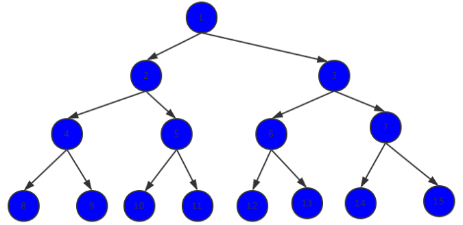
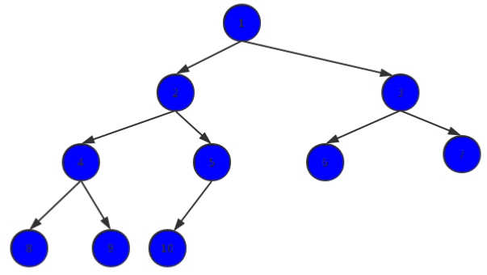

# 二叉树

* 二叉树是树的一种特殊情况，每个节点最多有有两个子女，分别称为该节点的左子女和右子女，就是说，在二叉树中，不存在度大于2的节点。二叉树的子树有左右之分，次序不能颠倒，下图是一个二叉树的结构图

## 二叉树的性质

* 在二叉树的第i(i>=1)层，最多有2^(i-1)个节点
* 深度为k(k>=1)的二叉树，最少有k个节点，最多有2^k -1 个节点
* 对于一棵非空二叉树，叶节点的数量等于度为2的节点数量加1
* 具有天然的递归结构
  * 每个节点的左子树也是二叉树
  * 每个节点的右子树也是二叉树
* 二叉树不一定是“满”的

## 特殊二叉树

* 满二叉树：
  * 深度为k的满二叉树，是有2^k-1 个节点的二叉树，每一层都达到了可以容纳的最大数量的节点

* 完全二叉树：
  * 深度为k的完全二叉树，从第1层到第k-1层都是满的，第k层，或是满的或是从右向左连续缺若干个节点

## 什么是二叉搜索树?

* 二叉搜索树（BST，Binary Search Tree），也称二叉排序树或二叉查找树

* 二叉搜索树是一颗二叉树, 可以为空
* 二叉搜索树每个节点的值：
  * 大于其左子树的所有节点的值
  * 小于其右子树的所有节点的值
* 每一颗子树也是二叉搜索树

## 二叉搜索树的操作

* add(key)：向二分搜索树添加新元素。
* contains(key)：在树中查找一个键，如果结点存在，则返回true；如果不存在，则返回false。
* inOrder：通过中序遍历方式遍历所有结点。
* preOrder：通过前序遍历方式遍历所有结点。
* postOrder：通过后序遍历方式遍历所有结点。
* minimum：返回树中最小的值/键。
* maximum：返回树中最大的值/键。
* isEmpty：判断二分搜索树是否为空，如果为空，则返回true；如果不为空，则返回false。
* remove(key)：从树中移除某个键

## 参考

- [Wikipedia](https://en.wikipedia.org/wiki/Binary_search_tree)
- [Inserting to BST on YouTube](https://www.youtube.com/watch?v=wcIRPqTR3Kc&list=PLLXdhg_r2hKA7DPDsunoDZ-Z769jWn4R8&index=9&t=0s)
- [BST Interactive Visualisations](https://www.cs.usfca.edu/~galles/visualization/BST.html)